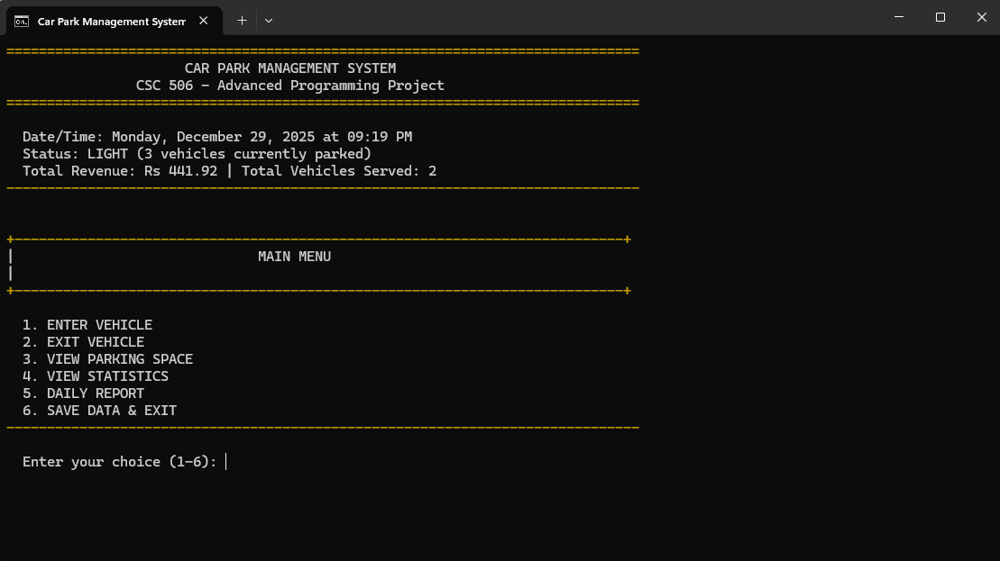
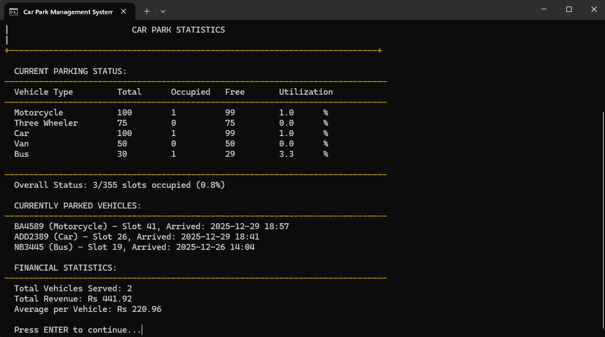

# Parking Management System (C)

A console-based Parking Management System developed in **C programming language** to simulate real-world parking operations including vehicle entry, exit, slot tracking and billing.

This project demonstrates key C programming concepts such as structures, file handling, arrays, functions and menu-driven interfaces to manage parking system data.

---

## 📸 Screenshots






## 🚀 Features

- Menu-driven parking interface  
- Add vehicle entry with tracking  
- Remove vehicle and compute parking duration  
- Display all vehicles currently parked  
- Check available parking slots  
- Stores data in files for persistence

---

## 🛠 Tech Stack

- C language  
- Console based interface  
- File handling for persistent storage

---

## 🎯 Purpose

This project was built to demonstrate:

- Core C programming concepts  
- Data structures (structs)  
- File handling and persistence  
- Logic implementation for real-world systems

It’s suitable for including in a portfolio to showcase **fundamental programming skills** and **system development basics**.

---

## ▶️ How to Run

1. Clone the repository  
```bash
git clone https://github.com/Bugzseater/Parking_Managment_System_C.git
